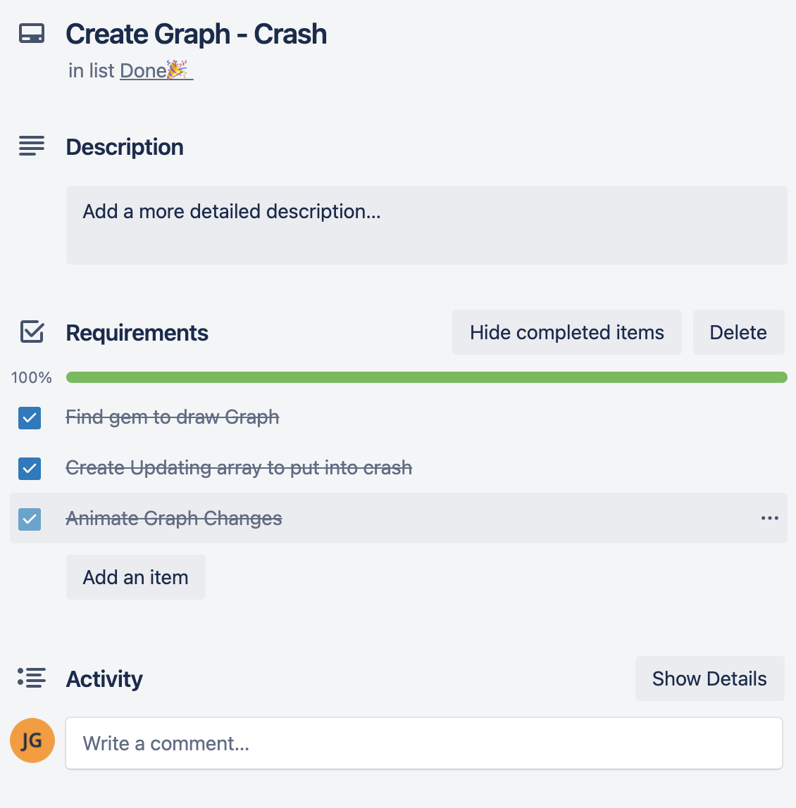

# JaredGoldsteinT1A3

## GitHub Link
Attached is a GitHub link to my repo - [here](https://github.com/JaredGold/Casino)

# Software Development Plans
My application is a Casino application designed to be fun and allow the user to blow off steam while not risking real money. In this application it will have 2-3 games which will cross save money and allow for a full fledged gambling experience.

Its main purpose is to target users who may already be gamblers or gamers and require a way to not spend their money and still tickle the users gambling itch. A user can find my application and use it to play a variety of games until they decide they are done with their experience. The best part about my application is it will be simple and still maintain ethical direction.

# Features
#### Permanent Money Saving

My application will have a method to permanently save and update a user file which will save the total money the user has acquired. It will do this by using a simple text file with the capabilities of `File.write` and `File.open` which will then read and convert the user money file an integer. After creating this money value after every time a game runs it will update the text file. If the file is read as a 0 or any number less than a valid number it will automatically reset the player money to $100.

#### Fair Blackjack

My blackjack game will be a fair representation of what blackjack would be like if you entered a casino. It will first take a deck of cards and give them a shuffle instead of pulling out a random card. Then it will take the first card in the deck (an object which holds an array of card objects) and first give it to the user. It will then loop through and give the next card to the dealer but this time be face down. This allows for a similar experience as you would experience in a real casino. Then loops through but this time giving the dealer a face up card for the user to see.

Finally as similar to blackjack in a casino when the user draws an Ace it will be able to be either valued as 1 or as 11. This feature will only trigger if the user goes over 21 or if the dealer goes over 21. It will cycle through all the cards in the users hands and find the ace then flip the value as necessary. 

#### Gambling Warning

Whilst making this application it is very important to me that I keep in mind the fact that gambling is a real problem that many people face every day. I would like to give all players the ability to reach out if they have any gambling addictions and wanted to reach out for support. In the start menu there will be a place for the user to find support if they so require it. I believe this will add some Ethical integrity to my app and remind users this is not just a game but could lead to a real problem.

#### Simple User Prompts

Taking advantage of gems offered by the community I am going to use TTY-Prompt to create a very simple user experience that can handle errors and keep the user from being required to do too much. Using Prompt will only allow specific inputs which will stop the user from being able to cause any errors or issues that I can not prepare myself for. I will use this throughout my whole program whenever a user is required to put in an input. Unfortunately I will have to create a buffer for when a slider becomes too large so with that I will then require a user input but verify what the users input is.

# User Interaction & Experience
The user will first run my code by using a Shell script to install all requirements and then run the application. It will first give the user a set of options to either read the rules, open games and/or close the application. If the user decides to read the rules I will explain how the application works to the users and then I will also give them a gambling warning. They then can head back and choose between all 3 games using tty-prompt.

If the user chooses to play blackjack it will initialize a blackjack menu. The menu will be very similar to that of the main menu. The user can play the game, read the rules or exit. If they choose to exit it will give them the option to go to the main menu or close the program. If they choose the rules I will explain the complete in and outs of how to play blackjack. Then if they choose to play the game it will show the user their total money and then ask the user how much they would like to bet. After the user bets an amount it will draw the cards and show the user the cards they have and their value. It will then give the user the ability to hit or stand. If the user chooses to hit it will draw them a new card and then loop through drawing. If the user chooses to stand it will then show the total value of the dealers hand and show the face down card. If the dealers value is less than 17 it will draw a card and repeat until the dealer value is 17 or above. If any of the previous criteria is met it will take the user to a screen where it will evaluate who has won. If the user is closer to 21 but not over or if the dealer is above 21 it will declare the user a winner and multiply the users bet by 2 and then add it to their total money. If the user's value went over 21 or the users value is further from 21 than the dealer and the dealer is not greater than 21 it will deduct the users bet from the total value. It will then give the user the ability to replay or quit (Back to menu or exit the application)

Else if the user chooses to play crash, they will be brought to a similar menu to blackjack with play, rules and exit. Rules and exit will work similarly to blackjack although crash game-play will be different. At the start the user will be asked how much to bet and then it will show a graph and an amount the stock is currently worth. It will refresh every 0.4 seconds and stop when the user finally presses return, if the user does not press return the stock will continue to grow. At any point the stock can crash and reset to 0. If it does the user will leave with no money. If the user plays and presses return it will stop and multiply the users bet by value when they pressed return. They then will be brought to a similar end screen to blackjack.

Else if the user chooses to play Horse Races they will be brought to a similar menu as the previous 3 games. If the user chooses to play they will again be given a gamble amount query and then take them to a new screen. This screen will allow them to pick a horse. When the user picks a horse they will then watch 6 custom loading bars race to reach 100%. When the first loading bar reaches the 100% it will stop and log the horse. If the horse is the same as the horse that the user bet it will show a congratulations and then times the bet by 6 and add it to the users total value. If the user's horse is not the same as the winning horse the bet amount will be subtracted from the users money value. Again the user can replay.

That is the end of the application. Through all of this if the user will not be able to put an input that is not already scripted. Because of this the user is unable to create any errors and thus the application is unable to crash.

# Control Flow

# Implementation Plan
My implementation plan was very rough and definitely needs to be worked on with my next project but working off of a schedule with deadlines was a very great way for me to complete this project. It allowed for a very rigorous and structured method.

---

# How To use Casino

### Requirements

- Ruby 2.7.2 ([Install here](https://www.ruby-lang.org/en/))
- MacOS or Linux (For windows users [WSL](https://docs.microsoft.com/en-us/windows/wsl/install-win10))

### How to Install
1. Clone or download the repo [here](https://github.com/JaredGold/Casino)!
2. Open the `./src` directory
3. In your chosen terminal run either `bash casino_install.sh` or `zsh casino_install.sh` to run and install.
4. After Installing to run normally use `bash casino.sh` or `zsh casino.sh`

#### *Inputs*
Running `bash casino.sh` will take some commands like so `... casino.sh -h`
- `-h` or `--help` loads help menu
- `-bj` or `--blackjack` loads blackjack
- `-hr` or `--horserace` loads horse racing
- `-cr` or `--crash` loads crash